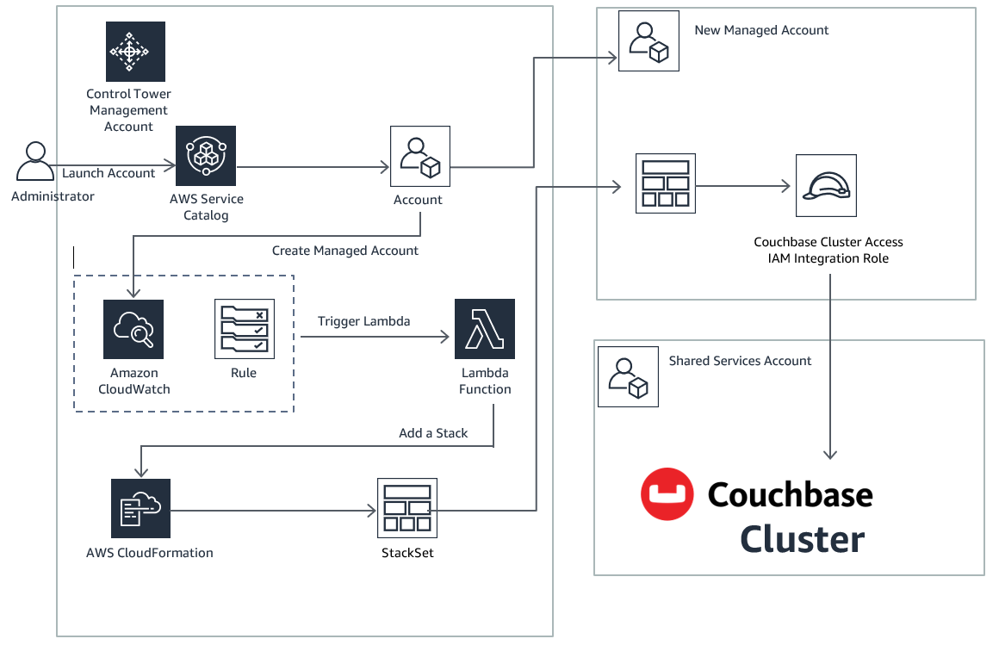

# Automate multi account data access in AWS using Couchbase and AWS Control Tower

## Prerequisite
It is expected that you have a [Couchbase Server Marketplace](https://aws.amazon.com/marketplace/pp/prodview-zy5g2wqmqdyzw) subscription

## Overview
The solution uses a Couchbase server cluster that is deployed in an AWS Shared Services account in your Control Tower organization. The solution is deployed using AWS CloudFormation templates and integrates with AWS Control Tower lifecycle events. 

When a new account is created, or an existing one is enrolled using the AWS Control Tower Account Factory, the lifecycle event triggers a Lambda function. The Lambda function creates 2 new CloudFormation stack instances - one in the newly vended managed account and another in the shared services account. The stack instance in the shared services account provisions a new user for the Couchbase Cluster and store its credentials in AWS Secret Manager in the shared services account. The stack instance in the newly vended account (i.e. control tower managed account) creates an IAM role for the managed account to access the couchbase server deployed in the shared services account.

## How to Install
The Couchbase integration with AWS Control Tower is set up in one step. Launch the [**control-tower-management.yml**](https://github.com/couchbase-partners/cb-control-tower/blob/main/control-tower-management.yml) template in the AWS Control Tower Management account. Provide the following parameters:
 - For the **CouchbaseBootstrapParameter** and **CouchbaseSecretArn** parameters enter the values from the prerequisites step
 - For the **SharedServicesAccountId** parameter enter the AWS Account Id of the shared services account where the Couchbase server is runnning
## Solution Design

## How to Test and Validate

 2. **Test - Add a Managed Account** 
     - From the Control Tower management account:
        - Use Account Factory or quick provision or Service Catalog to create a new managed account in the Control Tower organization or
        - Use Service Catalog to update an existing managed account - e.g. change the OU of an existing managed account.
        - This can take up to 30 mins for the managed account to be sucessfully created and the Control Tower lifecycle event to trigger.
        - Login to the Control Tower managed account - 
           - Validate that a CloudFormation stack has been provisioned and that the Ermetic integration IAM role has been created.
     - From the Control Tower managed account:
      - Navigate to the AWS CloudFormation console. Check that there is an AWS CloudFormation stack instance in this account that that launches the Couchbase IAM integration role in the managed account From the navigation pane, select this stack instance and choose Stack info. The status field should display a value of CREATE_COMPLETE.

4. **Validate**
    - Log into your Couchbase Server Cluster Administrative Webpage at [http://<ClusterAdminURL>:8091](http://<ClusterAdminURL>:8091) and go to the Security tab to view the created user for the managed account
